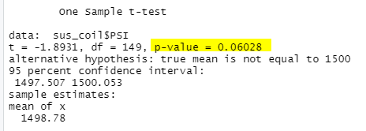
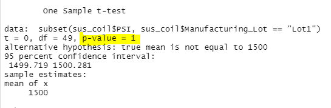
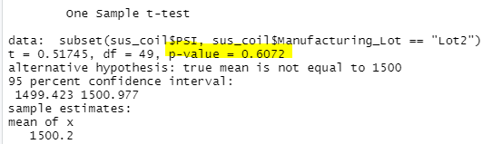
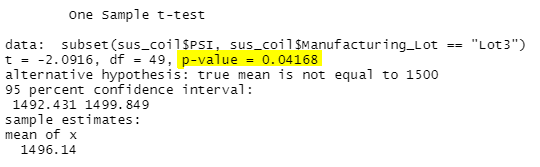

# MechaCar_Statistical_Analysis

## Linear Regression to Predict MPG
Linear Regression output:

The following variables/coefficients provide a non-random amount of variance to the mpg values, due to low Pr(>|t|) values:
- (Intercept)
- vehicle_length
- ground_clearance

The slope of the linear model is not considered to be zero, and the linear model predicts mpg of MechaCar prototypes effectively. This can be determined by viewing the r-squared value and p-value in the Linear Regression output.
The r-squared value is 0.715 (71.5%), which indicates that the regression model represents real-world data points quite well. In addition, the p-value is 5.35e-11, which is smaller than an assumed significance level of 0.05. 

## Summary Statistics on Suspension Coils
Total Summary for suspension coil's PSI:

Summary by Lot for suspension coil's PSI:

Based on design specs, the variance of the suspension coils must not exceed 100lbs/sq.inch. In viewing the summary tables above, it seems that the Variance for the PSI overall meets this design specification for all manufacturing lots in total. This is not true, however, for each individual manufacturing lot, as the Lot summary shows that Lot3 PSI has a variance of 170.3, which exceeds the design specifications. 

## T-Tests on Suspension Coils
T-test across all Manufacturing Lots:

T-test for Lot 1:

T-test for Lot 2:

T-test for Lot 3:

The p-value for each t-test can be viewed above. From these results, and an assumed significance level of 0.05, the following interpretations for the t-tests can be determined:
- PSI across all lots is statistically similiar since p-value = 0.06 is greater than the significance level.
- PSI for Lot1 is statistically similiar since p-value = 1 is greater than the significance level.
- PSI for Lot2 is statistically similiar since p-value = 0.61 is greater than the significance level.
- PSI for Lot3 is statistically different since p-value = 0.04 is lesser than the significance level.

## Study Design: MechaCar vs Competition
In comparing MechaCar to competitors, an important metric that a consumer may be interested in is fuel efficiency. In testing this metric, the following hypothesis can be considered:
- null hypothesis: MechaCar has better fuel efficiency than competetors.
- alternative hypothesis: MechaCar does not have better fuel efficiency than competetors.

In order to test the hypothesis, a two-sample t-test may be used, since it determines statistical difference between two samples, such as the data of MechaCar's fuel efficiency sample and the Competitor's fuel efficiency sample.